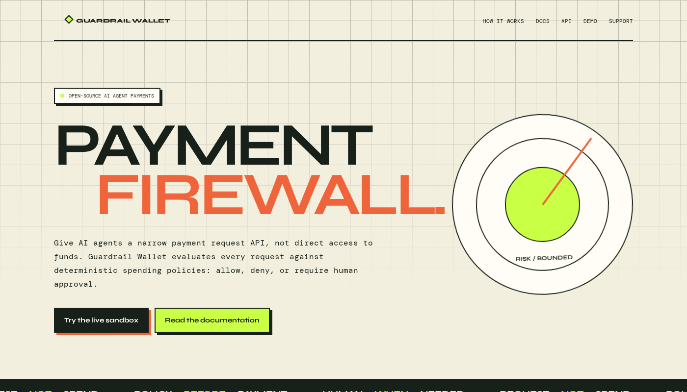

# Guardrail Wallet early-access launch

Guardrail Wallet is a self-hosted payment firewall for AI agents. An agent may
request a purchase; deterministic policy and the owner decide whether it proceeds.
The agent never receives owner authority.

> The public demo uses `EXECUTOR=stub` and moves no real money. It records a
> simulated lifecycle only.

## Try it in 60 seconds

1. Open the [live sandbox](https://patronhill.ru/dashboard).
2. Use the public owner token `guardrail-demo-owner`.
3. Submit the documented request with the public agent token
   `guardrail-demo-agent`.
4. Inspect the policy reason and approve or reject the request.

Prefer web text mode: [walkthrough](https://patronhill.ru/docs)

## Run it at home

Clone the repository, copy `.env.example`, keep `EXECUTOR=stub`, and start with
Docker or `npm run dev`. Never put a mnemonic or payment credential in an agent
prompt.

## What we need from early testers

- installation reports with OS, Node or Docker version, and the failing command;
- agent integrations that use the narrow request API;
- household workflows that need explicit limits and approval;
- review of the threat model and fail-closed behavior.

## Current limits

The project is early access. The hosted demo is public and resettable. The TON
executor and chain guardrail are experimental and unaudited. Do not place large
mainnet balances behind this software.

## Links

- [Live demo](https://patronhill.ru)
- [Documentation](https://patronhill.ru/docs)
- [API reference](https://patronhill.ru/api)
- [Security model](../SECURITY.md)
- [Repository](https://github.com/nordpaul/guardrail-wallet)
